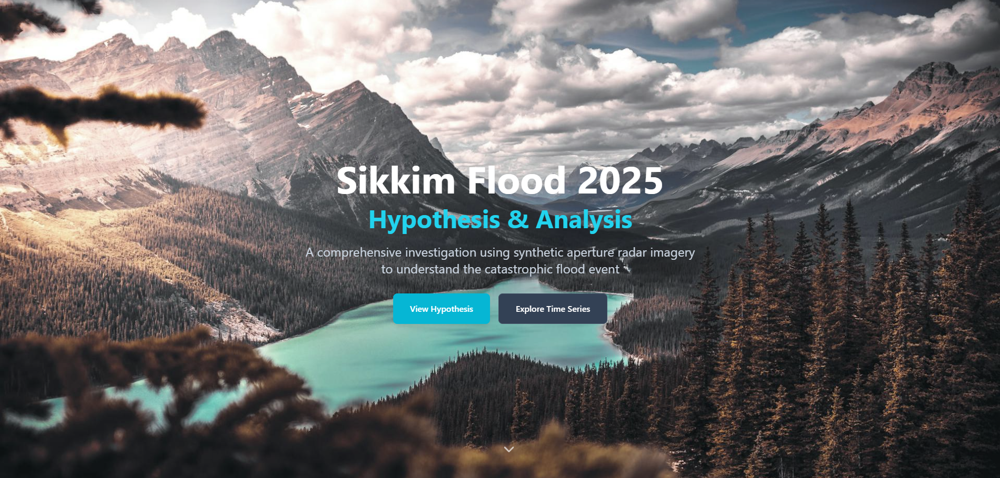

# 🌊 The Sikkim Study: SAR-based Flood Analysis  
### NASA International Space Apps Challenge 2025  

**Team Name:** Cosmic Narrator  
**Team Members:** Soham Banerjee, Arnab Satpati, Ritesh Kumar Rawat, Arshdeep Singh  
**Challenge Category:** Through the Radar Looking Glass — Revealing Earth Processes with SAR  
**Date:** 5th October 2025  

---

## 🚀 Project Overview  
**Cosmic Narrator** is an AI-powered geospatial analysis platform designed to study and understand the underlying causes of floods and landslides in **Sikkim** using **Synthetic Aperture Radar (SAR)** data, satellite imagery, and environmental indicators.  

Landslides and floods frequently impact this mountainous region, causing severe human and infrastructural losses. This project integrates **SAR data analysis**, **machine learning**, and **interactive geospatial visualization** to identify and monitor terrain changes, rainfall correlations, and glacial melt-driven flooding events.  

By merging **scientific accuracy** with an **intuitive web interface**, the system offers real-time insights for disaster risk assessment and sustainable mitigation planning.  

---

## 🛰️ How Does Project Cosmic Narrator Work?

1. **SAR Data Integration** — Sentinel-1 data (VV & VH polarizations) is processed for pre- and post-event scenes.  
2. **Change Detection Algorithm** — Gaussian blur + absolute difference + morphological cleaning identify change zones.  
3. **Flood Detection & Attribution** — Combines radar intensity shifts with rainfall anomalies and glacier retreat signals.  
4. **Interactive Web Dashboard** — Built using React + Tailwind + Supabase, visualizes results over Google Maps.  
5. **Insights & Reports** — Generates driver attribution reports linking rainfall (>200 mm/day), terrain deformation, and glacier melt.  

This combination of **satellite-based SAR analysis** and **real-time web mapping** brings a transparent, data-driven perspective to flood and landslide studies.

---

## 💻 User Interface & Experience

### 🌍 **Main Dashboard**
- Interactive **map view** with SAR backscatter (VV/VH composite) and detected flood extent overlays.  
- **Time Slider** for multi-temporal visualization of water level variations (e.g., Mangan river reach).  
- **Key Performance Indicators (KPIs):**  
  - Daily rainfall (mm)  
  - Area flooded (km²)  
  - Number of affected settlements  
  - Impacted infrastructure  

### 📊 **Driver Attribution & Report**
- Correlates multiple factors:  
  - **Rainfall totals:** >200 mm in 24 hrs (IMD data)  
  - **Dam-site blockages:** detected via SAR dark spots/log residues  
  - **Glacial melt:** tracked using Pauhunri glacier multi-temporal retreat  
- Generates a **compound driver report** explaining the flood triggers.  

### 🧠 **AI-powered Tool**
An integrated AI module automates:
- SAR image ingestion  
- Surface change detection  
- Risk prediction  
- Hypothesis validation via an interactive chatbot  

---

## 🧰 Technical Implementation  

### **Data Sources & Processing**
- **Sentinel-1 SAR (VV & VH):** multi-temporal stack (weekly scenes, 10-year trend).  
- **Sentinel-2 Optical:** NDWI/NDVI confirmation.  
- **DEM:** SRTM / Copernicus terrain correction.  
- **IMD Rainfall Reports:** Validation (>200 mm/24 hrs in North Sikkim on 1 June 2025).  
- **Outputs:** GeoTIFFs, vector masks, and web-based visualizations.

---

## 🎯 Project Goals & Impact

**Primary Goals**
- Provide **near-real-time flood mapping** even in cloud-covered terrains via SAR.  
- Attribute flood causes to guide **mitigation and response planning**.  
- Deliver **actionable insights** to emergency teams, hydropower operators (Teesta-III, Dikchu HEP), and policymakers.

**Impact**
This project demonstrates how open-source **Earth observation data** and **AI tools** can be integrated to address real-world climate resilience and disaster management.

---

## ⚙️ Technology Stack  

**Version Control:** GitHub  
**Development Environment:** VS Code  
**Programming Languages:** TypeScript, JavaScript, HTML, CSS  
**Deployment:** Netlify  
**Frameworks & Libraries:** React, Vite, Tailwind CSS, Lucide React  
**Backend & Database:** Supabase (PostgreSQL-based backend with auth and storage)  
**APIs & External Services:** Copernicus Open Access Hub (Sentinel Data), IMD Rainfall Records  

---

## 🧩 Challenges & Solutions  

| Challenge | Solution |
|------------|-----------|
| **Cloud cover blocking optical imagery** | Used **SAR (Sentinel-1)** which operates day & night, cloud-penetrating. |
| **Terrain-induced distortions in SAR data** | Applied **DEM-based terrain correction** and slope masking. |
| **Limited labeled training data** | Used **transfer learning** (ResNet backbone) + simulated flood masks for augmentation. |

---

## 🔮 Future Development  

1. **Real-Time Alerts:** Automate ingestion + inference pipeline for early warnings.  
2. **Driver Detection:** Add classifiers for dam blockages and glacier retreat quantification.  
3. **Community Tools:** Mobile app for on-ground flood/damage reporting.  
4. **Conversational AI:** Chatbot for interactive data insights.  

---

## 🌐 Resources & Links  

**Repository:**  
- [Sikkim Flood Analysis](https://github.com/Arnab-satpati/Sikkim-Flood-Analysis)  
- [Sikkim Flood Analysis Tool](https://github.com/Arnab-satpati/Sikkim-Flood--Analysis-Tool)  

**Live Demo:**  
[LinkedIn Demo Video](https://www.linkedin.com/posts/arnab-satpati_climatechange-sikkimfloods-disastermanagement-activity-7380618189786963968-45BZ?utm_source=share&utm_medium=member_desktop&rcm=ACoAAEBZmckB539xJ_N03UxO-HhoyZT5dO5TjvI)

**Website:**  
[Sikkim Flood Analysis Platform](https://sikkim-flood-analysis.netlify.app/)  

**Data Sources:**  
Copernicus Open Access Hub (Sentinel-1, Sentinel-2), IMD Rainfall Records, SRTM/Copernicus DEMs  

---

## 🙏 Acknowledgments  
We thank the **NASA Space Apps Challenge organizers**, the **Copernicus program** for open satellite data, and all **mentors and advisors** who guided us through this journey.

---

## 📅 Appendix  

**Event:** Sikkim Flood — June 1, 2025  
- IMD recorded >200 mm rainfall in 24 hrs in North Sikkim.  
- Triggered flash floods and landslides due to saturated slopes and dam obstruction.  

**Key AOIs:**  
- Chungthang (Teesta-III Dam)  
- Mangan  
- Lachen-Lachung Valleys  
- Dikchu HEP  
- NH-10 bridges and connected infrastructure  

**Key Findings:**  
- Compound drivers:  
  - Dam-site obstruction (SAR-detected debris)  
  - Extreme rainfall  
  - Glacial meltwater rise (Pauhunri glacier 2016–2025 retreat)

---

## 📬 Contact Information  

**Team Email:** [banerjee.soham08122001@gmail.com](mailto:banerjee.soham08122001@gmail.com)  

For questions or collaboration inquiries, visit our GitHub repository or contact us directly.  

---
# Few website Snippets

## Dashboard

## interactive map

## Side-by-side comparison (Pre, During, Post Flood Visuals)

## Hypothesis

